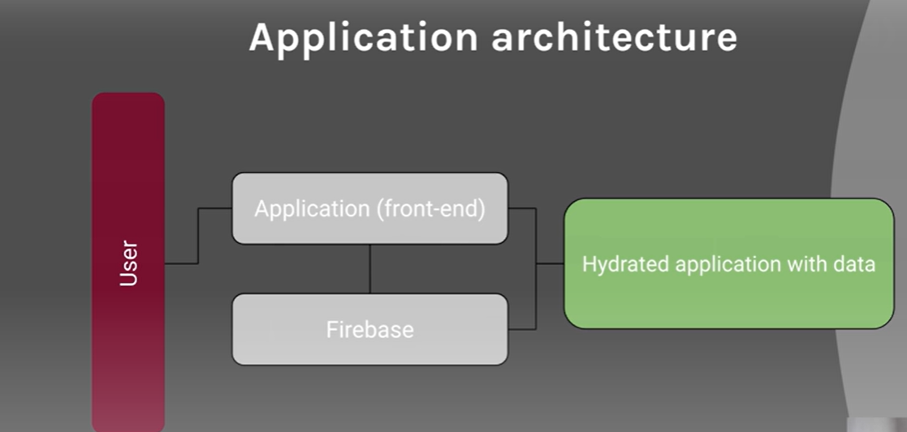
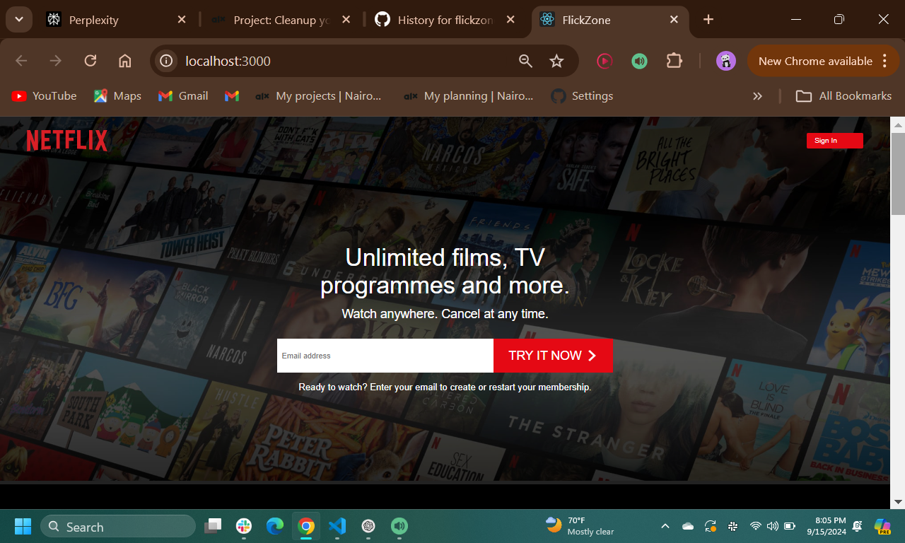
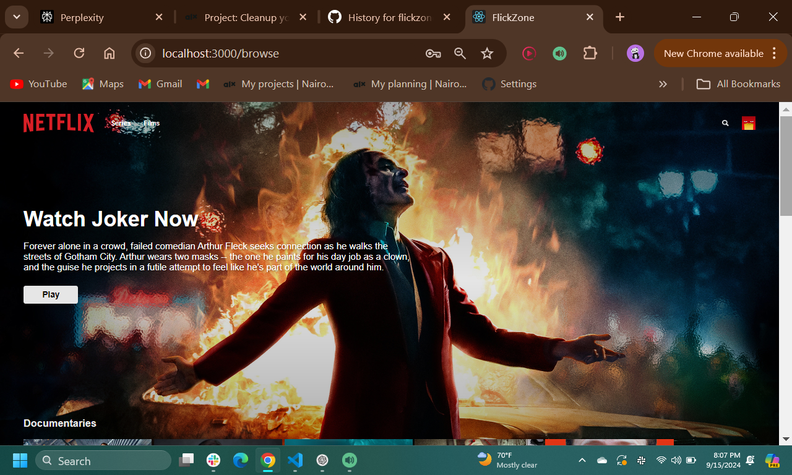
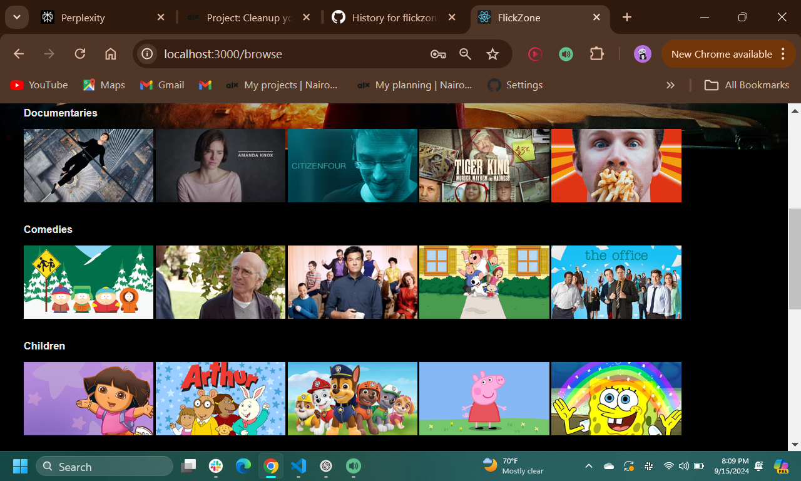

<h1 align="center">Welcome to FLICKZONE 👋</h1>
<p>
  
</p>


## Introduction

FlickZone is a Netflix clone that showcases my skills in web development. This project demonstrates my ability to build a full-stack application using modern technologies.

- **Final Project Blog Article**: [Read the Article](https://medium.com/@iammakena/i-built-a-netflix-clone-using-react-and-firebase-d94ead9bea2a)

- LinkedIn: [Profile](https://www.linkedin.com/in/alicemakena/)

### ✨ [Demo](https://youtu.be/4ptDaEW7S8E)

## Inspiration
   I’ve always been fascinated by streaming platforms and wanted to build one that emulates the simplicity and smoothness of Netflix. I also saw this as an opportunity to solve a real-world technical challenge: how to efficiently handle large datasets of movies while ensuring smooth user experiences. FlickZone was born from a combination of passion and a desire to push my boundaries as a developer.


## Screenshots
### Application Architecture

This architecture diagram shows the flow of data and user interaction in the FlickZone application using React on the frontend and Firebase for backend services.

1. **User**:
The user interacts with FlickZone via the frontend application. This is the starting point where users can search for movies, view their watchlists, or browse movie categories.

2. **Application (Front-End)**:
The React frontend serves as the user interface. It is responsible for rendering the components that users interact with (e.g., movie listings, search bar, watchlist management). When users perform actions like searching for movies or logging in, the frontend makes requests to Firebase for data or authentication.

3. **Firebase (Backend Services)**:
Firebase handles the backend logic for the FlickZone application. It manages the following tasks:

- **Authentication**: Ensures secure login and sign-up processes (using Firebase Authentication) with email, Google, or other OAuth providers.
- **Firestore Database:** Stores user-specific data such as watchlists, movie preferences, and user profiles. It also holds the movie data fetched from external sources or APIs.
- **Real-Time Updates**: Firebase’s real-time database or Firestore keeps the front-end updated whenever data changes. For example, if a user adds a movie to their watchlist, Firebase automatically syncs and updates the data on the client side.

4. **Hydrated Application with Data**:
The React frontend, once connected to Firebase, hydrates the app with real-time data. Hydration in this context means that the frontend fetches and updates itself with user-specific and movie-related data coming from Firebase. The result is an interactive app where users can:

- View personalized content (e.g., their watchlist)
- Fetch the latest movie data
- Interact with real-time features (like adding/removing movies from a watchlist)

**Flow Summary**:
1. The user initiates actions on the front-end (React app).
2, The app communicates with Firebase to authenticate users, retrieve movie data, or update watchlists.
3. Firebase sends back the requested data, and the app renders the updated content to provide a seamless user experience.
4. The React app gets hydrated with fresh data, making the interaction dynamic and up-to-date

Here are some screenshots of FlickZone in action:

### Home Page


### Movie Detail Page



## Installation
To get a local copy up and running, follow these steps:

1. **Clone the repository**:
   ```bash
   git clone https://github.com/Makena-Wambui/FLICKZONE.git

2. **Navigate to the project directory**:
   ```bash
   cd flickzone

3. **Install dependencies**:
   ```bash
   npm install
   ```

4. **Set up environment variables**: 
   Create a .env file in the root directory and add the required environment variables. Example:
   ```makefile
   REACT_APP_API_URL=your-api-url
   ```
## Usage
   ```bash
   npm start
   ```
   After setting up the project, you can use FlickZone by navigating to http://localhost:3000 in your web browser. The application allows users to browse and watch movies, similar to Netflix.

## Contributing
   Contributions are welcome! If you'd like to contribute, please follow these steps:
1. **Fork the repository**.
2. **Create a new branch**:
   ```bash
   git checkout -b feature/your-feature
   ```
3. **Commit your changes**: 
   ```bash
   git commit -am 'Add new feature'
   ```
4. **Push to the branch**: 
   ```bash
   git push origin feature/your-feature
   ```
5. **Create a new Pull Request.**
   Please ensure your code follows the project's coding standards and includes relevant tests.

## Technical Challenges and Solutions
In this section, I’ll explain the key technical challenges I faced while building FlickZone using React and Firebase, along with the solutions I implemented to overcome these obstacles.

1. ### Authentication and Authorization with Firebase
**Challenge**: 
One of the main challenges was integrating Firebase Authentication for handling user sign-ups, logins, and social login providers like Google and Facebook. Configuring these providers and managing different user states securely within React components was tricky, especially since Firebase’s documentation can sometimes be sparse in edge cases.

**Solution**: 
To solve this, I followed Firebase’s authentication guides closely and made use of React Context to handle global user state. I created a custom AuthContext that wraps the entire application, so the authentication state is available across components. Additionally, Firebase's built-in methods like onAuthStateChanged helped track authentication states seamlessly, allowing me to easily show personalized content based on the logged-in user.

2. ### Real-time Database and Firestore
**Challenge**:
A key part of FlickZone was allowing users to manage their watchlists in real-time. Managing real-time updates from Firebase Firestore and ensuring that the app UI was synced with these updates posed a challenge, especially when handling large amounts of data efficiently in React components.

**Solution**:
I used Firebase’s Firestore as my primary database because of its real-time synchronization capabilities. To optimize performance and avoid unnecessary re-renders in React, I used Firestore’s onSnapshot method to listen for real-time updates and efficiently update only the affected parts of the UI. I also leveraged React’s useEffect and useState hooks to trigger database updates and refresh the UI in a controlled manner, keeping performance optimal.

3. ### Security Rules for Firebase
**Challenge**:
Setting up secure and efficient Firebase Firestore security rules was another critical challenge. I had to ensure that only authenticated users could access and modify their own watchlists while preventing unauthorized access to other users’ data.

**Solution**:
I configured Firestore’s security rules to restrict access to authenticated users based on their uid (unique identifier in Firebase). For example, I ensured that users could only read and write data where the uid in the database matched their authentication uid. This setup effectively restricted users to accessing only their own data, securing sensitive user information while allowing flexibility in managing personal watchlists.

## Lessons Learned
One of the biggest challenges I faced was integrating Firebase for user authentication. Despite reading countless tutorials, I hit a wall when it came to configuring OAuth providers like Google and Facebook. After many hours of troubleshooting and revisiting documentation, I finally got it to work. This experience taught me perseverance and the importance of detailed documentation.

Managing the Timeline as a Solo Developer:
As I was working on this project alone, balancing all the tasks from frontend development, backend integration, and testing was a challenge. I tried to use project management tools like Trello to organize my work and track progress, which helped me stay on schedule. Breaking down the project into smaller milestones and iterating over them allowed me to make consistent progress without feeling overwhelmed by the scope of the project.

## Next Iteration and Future Improvements
Moving forward, I want to optimize the app's performance by lazy-loading images and integrating server-side rendering (SSR) to boost SEO. I also plan to introduce user-generated content, allowing users to leave reviews and ratings on movies. Implementing a recommendation engine using machine learning algorithms is another exciting direction I'd like to explore.

## Related Projects
   Here is a related project with additional features you might find interesting:
   ### ✨ [Full Stack Netflix Clone with Reactjs And Firebase](https://www.youtube.com/watch?v=YQQD67N5pi0)

## Licensing
   This project is licensed under the MIT License - see the LICENSE file for details.

## Final Thoughts
FlickZone has been a rewarding journey for me as a developer. Through this project, I not only honed my technical skills but also developed a deeper appreciation for tackling complex problems.

## Author
👤 **Alicia Makena**

* Github: [@Makena-Wambui](https://github.com/Makena-Wambui)

## Show your support

Give a ⭐️ if this project helped you!
